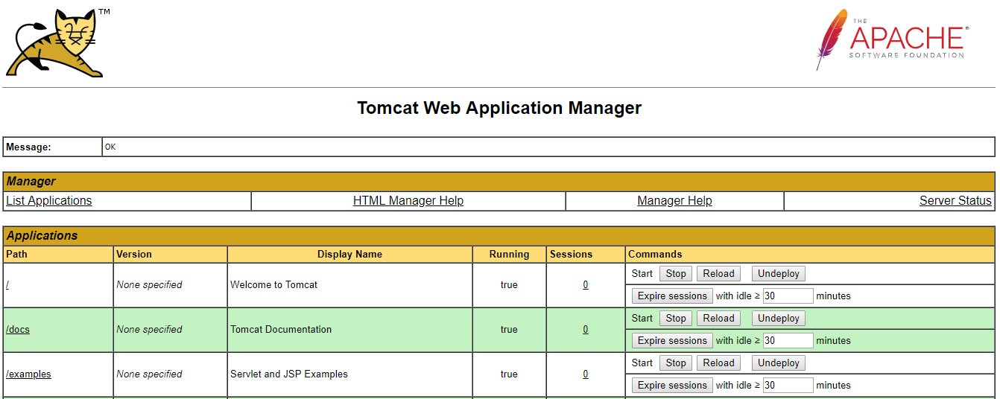

### Hi,

In this tutorial we will install Tomcat 9 on Ubuntu 18.04.

## Step 1 - Installing JDK

Tomcat 9 requires Java 8 or later versions to work. You can check and verify that Java is installed with the following command.

```
$ java -version
```

If java is not installed run below commands to install Java.

```
$ sudo apt-get update
$ sudo apt-get install default-jdk
```

After installation check if java is installed correctly by executing below command.

```
$ java -version
```


 
If java is installed, the output should look similar to above depending upon what is the latest version of java at that time.

## Step 2 - Creating a Tomcat user and group

We should not run tomcat under the root user for security reasons. Let’s create a group **tomcat** and add a user **tomcat** to it. Additionally, we are going to install tomcat under **/opt/tomcat** directory which will be tomcat user home directory:

```
$ sudo groupadd tomcat
$ sudo useradd -s /bin/false -g tomcat -d /opt/tomcat tomcat
```

## Step 3 – Download and Install Tomcat 9

Now we need to download and install Tomcat 9. You need to download the Tomcat 9 archive from its official download website or mirrors. Download and Install Tomcat 9 archive file using the following commands. You can also visit [official download page](https://tomcat.apache.org/download-90.cgi) to download latest available version.

We are going to install Tomcat to **/opt** directory. So we will download the Tomcat 9.0.21 package to that location.

Change directory to **/opt** and download tomcat 9 to that directory.

```
$ cd /opt
$ sudo wget https://www-eu.apache.org/dist/tomcat/tomcat-9/v9.0.21/bin/apache-tomcat-9.0.21.tar.gz
```

Extract the tar package and rename the extracted directory to tomcat

```
$ sudo tar -xvzf apache-tomcat-9.0.21.tar.gz
$ sudo mv apache-tomcat-9.0.21 tomcat
```

Also modify ownership and permissions of **/opt/tomcat** directory.

```
$ sudo tar -xvzf apache-tomcat-9.0.21.tar.gz
$ sudo mv apache-tomcat-9.0.21 tomcat
```

## Step 4 – Change Permission and Ownership of Tomcat home directory

Next we will modify ownership and permission of **/opt/tomcat** directory. We will also give executed permission to **opt/tomcat/bin/** directory.

```
$ sudo chown -R tomcat: tomcat
$ sudo chmod o+x /opt/tomcat/bin/
```

## Step 5 – Creating a SystemD Service File for Tomcat

To install Tomcat as system service we will create a file called **tomcat.service** in the **/etc/systemd/system** directory.

```
$ sudo nano /etc/systemd/system/tomcat.service
```

Add the following to tomcat.service file

```
[Unit]
Description=Tomcat 9 Server
After=network.target

[Service]
Type=forking
User=tomcat
Group=tomcat

Environment="JAVA_HOME=/usr/lib/jvm/default-java"
Environment="JAVA_OPTS=-Xms512m -Xmx512m"

Environment="CATALINA_BASE=/opt/tomcat"
Environment="CATALINA_HOME=/opt/tomcat"
Environment="CATALINA_PID=/opt/tomcat/temp/tomcat.pid"
Environment="CATALINA_OPTS=-Xms512M -Xmx1024M -server -XX:+UseParallelGC"

ExecStart=/opt/tomcat/bin/startup.sh
ExecStop=/opt/tomcat/bin/shutdown.sh

UMask=0007
RestartSec=10
Restart=always
[Install]
WantedBy=multi-user.target
```

Save and the exit file. Restart systemctl daemon.

```
$ sudo systemctl daemon-reload
```

To start the tomcat service :

```
$ sudo systemctl start tomcat
```

To monitor tomcat log file :

```
$ sudo tail -f /opt/tomcat/logs/catalina.out
```

If there is no error, you will get similar to below output:

 
 
We can now access tomcat at:

```
http://<public-machine-ip>:8080/
```


To start Tomcat service on system boot:

```
$ sudo systemctl enable tomcat
```

The default Tomcat port is 8080, so we need to allow that port on Ubuntu firewall.

```
$ sudo ufw allow 8080/tcp
```

Check firewall status:

```
$ sudo ufw status
```

## Step 6 – Enable and Secure Tomcat Web Application Manager and Virtual Host Manager

Tomcat has a **Web Application Manager** and **Virtual Host Manager** app that come preinstalled. In order to use these, we have to first secure them with authentication and authorization. This is done via the **tomcat-users.xml** file. Open and edit tomcat-users.xml:

```
$ sudo nano /opt/tomcat/conf/tomcat-users.xml
```

Add the following between **<tomcat-users>** tags and save. The roles required to access Web Application Manager and Virtual Host Manager are **manager-gui** and **admin-gui** respectively.
 
 ```
<role rolename="admin-gui"/>
<role rolename="manager-gui"/>
<user username="admin" password="123admin456" roles="admin-gui,manager-gui"/>
```

## Step 7 – Configure Tomcat Web Application Manager

The Tomcat web application manager is configured to allow access only from the localhost. To allow remote access we have to edit the 
 **/opt/tomcat/webapps/manager/META-INF/context.xml**
 
**_This is not recommended for production environments!!_**

Open the context.xml file:

```
$ sudo vim /opt/tomcat/webapps/manager/META-INF/context.xml
```

Comment the lines as shown below:

 
 
Save and exit.

Restart tomcat service for changes to take effect.

```
$ sudo systemctl restart tomcat
```

After tomcat is restarted we can access the Web Application Manager console at the following link.

```
http://<tomcat-public-ip>:8080/manager/html
```


Enter the user and password as configured in **Step 6**.

## Step 8 – Configure Tomcat Virtual Host Manager

The Tomcat virtual host manager is configured to allow access only from the localhost. To allow remote access we have to edit the 
 **/opt/tomcat/webapps/host-manager/META-INF/context.xml**

**_This is not recommended for production environments!!_**

Open the context.xml file

```
$ sudo vim /opt/tomcat/webapps/host-manager/META-INF/context.xml
```

Comment the lines as shown below:


 
Save and exit.

Restart tomcat service for changes to take effect.

```
$ sudo systemctl restart tomcat
```

After tomcat is restarted we can access the Virtual Host Manager console at the following link.

```
http://<tomcat-public-ip>:8080/host-manager/html
```


Enter the user and password as configured in **Step 6**.

#### This concludes our tutorial on setting up Tomcat 9 on Ubuntu 18.04.
